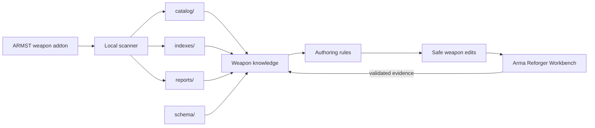

# Weapon_ARMA_X

> Weapon authoring, analysis, and validation toolkit for the **ARMST Arma Reforger** weapons addon.

This repository is intentionally focused on **weapons and weapon systems in Arma Reforger only**. It exists to make work on weapon prefabs, magazines, ammunition, optics, attachments, compatibility, ballistics, and related Enfusion data safer and easier to inspect.

It combines a local scanner, generated weapon catalogs/indexes, JSON schemas, Workbench-validated authoring rules, and research notes. The live addon remains the source of truth for current implementation.

> [!IMPORTANT]
> Start with [`reports/KNOWLEDGE_STATUS.md`](reports/KNOWLEDGE_STATUS.md). It defines what is current, generated, experimental, or historical.
>
> Browse the current generated weapon catalog through [`WEAPON_INDEX.md`](WEAPON_INDEX.md).
>
> Compare important weapon families in [`reports/families/`](reports/families/README.md).
>
> Inspect generated balance comparisons in [`reports/balance/`](reports/balance/README.md).
>
> Review catalog inconsistencies in [`reports/DATA_QUALITY.md`](reports/DATA_QUALITY.md).

## Scope

Weapon_ARMA_X is for Arma Reforger weapon work:

- weapon prefab authoring and inheritance;
- magazines, ammunition, projectile and ballistic data;
- optics, muzzle devices, handguards and other weapon attachments;
- attachment-slot and mount compatibility;
- fire modes, recoil, sights, zeroing and related weapon configuration;
- scanning and indexing the ARMST weapon addon;
- safe AI/local-agent assistance for weapon edits;
- Workbench validation records and weapon-specific research.

It is **not** intended to become a general-purpose Arma Reforger project repository.

## Source of truth

Authoritative working addon root:

`C:\Users\yshky\Documents\My Games\ArmaReforgerWorkbench\addons\ARMST-PLATFORM---Weapons`

Normal weapon editing, prefab/config/script lookup, and canonical source scans should target this addon.

`Armst_Work` is a sandbox/test addon unless a task explicitly targets it.

Detailed root-selection rules: [`agent/PRIMARY_MOD_POLICY.md`](agent/PRIMARY_MOD_POLICY.md).

## How the repository fits together

The important distinction is:

- **live addon / Workbench evidence** tells us what currently works;
- **catalogs and indexes** are generated snapshots used for lookup and analysis;
- **reports and policies** explain safe authoring and active design decisions;
- **schemas** keep structured weapon data consistent.

## Quick start

For weapon work, use this order:

1. Read [`reports/KNOWLEDGE_STATUS.md`](reports/KNOWLEDGE_STATUS.md).
2. Confirm the task targets the primary ARMST weapon addon.
3. Use the relevant authoring guide or generated index before inventing values.
4. Resolve prefab inheritance before editing a child.
5. Make one minimal logical change at a time.
6. Treat static validation as separate from Workbench/runtime validation.

For local-agent edits, follow [`agent/SAFE_PREFAB_EDITOR.md`](agent/SAFE_PREFAB_EDITOR.md).

## Repository map

| Path | Purpose |
|---|---|
| [`WEAPON_INDEX.md`](WEAPON_INDEX.md) | Human-readable weapon catalog grouped by type, caliber and evidence status |
| `agent/` | Local-agent policies, scanner state, parser and scanner tools |
| `catalog/` | Generated per-entity weapon-system facts |
| `indexes/` | Generated and curated lookup/index data for authoring |
| [`reports/families/`](reports/families/README.md) | Generated AK/RPK, 9×39 and shotgun comparison pages |
| [`reports/balance/`](reports/balance/README.md) | Generated weapon / magazine / projectile balance comparisons |
| [`reports/DATA_QUALITY.md`](reports/DATA_QUALITY.md) | Catalog contradictions, unresolved relationships and automated quality checks |
| `reports/` | Authoring guides, active policies, research and generated reports |
| `schema/` | JSON schemas for weapon, magazine, ammunition and compatibility data |

See [`reports/README.md`](reports/README.md) for a human-readable report index.

## Core authoring references

| Task | Primary reference |
|---|---|
| Current project truth / freshness | [`reports/KNOWLEDGE_STATUS.md`](reports/KNOWLEDGE_STATUS.md) |
| Safe local prefab editing | [`agent/SAFE_PREFAB_EDITOR.md`](agent/SAFE_PREFAB_EDITOR.md) |
| Primary addon selection | [`agent/PRIMARY_MOD_POLICY.md`](agent/PRIMARY_MOD_POLICY.md) |
| Prefab authoring | [`reports/PREFAB_AUTHORING_GUIDE.md`](reports/PREFAB_AUTHORING_GUIDE.md) |
| Ammo/config authoring | [`reports/CONFIG_AUTHORING_GUIDE.md`](reports/CONFIG_AUTHORING_GUIDE.md) |
| Weapon script/module authoring | [`reports/SCRIPT_MODULE_AUTHORING_GUIDE.md`](reports/SCRIPT_MODULE_AUTHORING_GUIDE.md) |
| Active optics compatibility | [`reports/OPTICS_COMPATIBILITY_SYSTEM_V2.md`](reports/OPTICS_COMPATIBILITY_SYSTEM_V2.md) |
| AP/BP ammunition gameplay policy | [`reports/AMMO_AP_BP_POLICY.md`](reports/AMMO_AP_BP_POLICY.md) |
| Structured compatibility data | [`schema/compatibility.schema.json`](schema/compatibility.schema.json) |

## Generated authoring data

Use generated data as lookup material, not as a substitute for newer live-addon or Workbench evidence.

Important entry points:

- `indexes/prefab_authoring/manifest.json` — weapon/prefab authoring index;
- `indexes/prefab_authoring/shard_01.json` … `shard_04.json` — parent paths, GUIDs, instance IDs and discovered handling fields;
- `indexes/prefab_authoring_reference.json` — verified component IDs and family baselines;
- `indexes/config_reference/manifest.json` — AmmoConfig / AIBallistic / magazine → projectile relationships;
- `indexes/script_reference/manifest.json` — script compatibility inventory;
- `indexes/script_reference/slot_and_sight_summary.json` — weapon-side attachment slots and sight authoring boundaries;
- `indexes/script_reference/optic_compatibility_policy_v2.json` — active optics gameplay compatibility data;
- `catalog/weapons/*.json`, `catalog/ammunition/*.json`, `catalog/attachments/*.json` — per-entity snapshots with provenance.

## Authoring rules

**Prefab resolution:** child local block/value > nearest parent > common family base.

If a child contains its own recoil, fire-mode, or slot block, that local block wins even if some values still require resolution.

**Ammunition resolution:** magazine `AmmoConfig` defines the allowed ordered resource list; magazine `AmmoMapping` defines what is actually loaded. Mixed magazine counts must come from serialized mapping rather than filenames.

**Weapon scripts:** ARMST weapon `.c` files are primarily compatibility marker types such as `MagazineWell*`, `AttachmentMuzzle*`, and `AttachmentOptics*`. Sight behavior, ADS, zeroing, and pivots remain prefab data.

**Optics compatibility:** the module type must inherit the type required by the weapon slot. Approved Russian/Soviet side-rail weapon and optic combinations use the active gameplay compatibility policy documented in the V2 optics references. Real-world compatibility remains separate from gameplay simplification.

**Editing:** preserve the parent prefab and override only real differences using inherited instance IDs. Unknown engine values remain unknown.

## Current validated weapon examples

Useful Workbench-backed samples include:

- `reports/samples/armst_AEK971_test_v12_NAME_DESCRIPTION.et`;
- `reports/samples/armst_Optic_PSO1_DovetailRU.et`;
- `reports/samples/armst_TT_authoring_sample_v4.et`;
- `reports/samples/AttachmentOpticsARMST.c`.

### TT-33 source boundary

The supplied TT source chain resolves `Ammo_763x25.conf` → `Ammo_763x25_Ball.et`, with the TT magazine resolving to 8 rounds through its PM magazine parent.

The supplied projectile snapshot records:

- InitSpeed: `430`;
- Mass: `0.00804`;
- AirDrag: `0.0000125`;
- PenetrationDepth: `20`;
- PenetrationSpeed: `355`;
- inherited primary kinetic DamageValue: `50`.

The source also references `AIBT_9x19_Ball_M882.conf`. That fact is preserved as source evidence rather than silently replaced with assumed real-world Tokarev values.

## Freshness and historical material

Some files are generated snapshots or historical research checkpoints. Do not treat a filename, old report, or archived policy as automatically authoritative.

When files disagree, follow the authority order in [`reports/KNOWLEDGE_STATUS.md`](reports/KNOWLEDGE_STATUS.md).

For a categorized report list, see [`reports/README.md`](reports/README.md).
